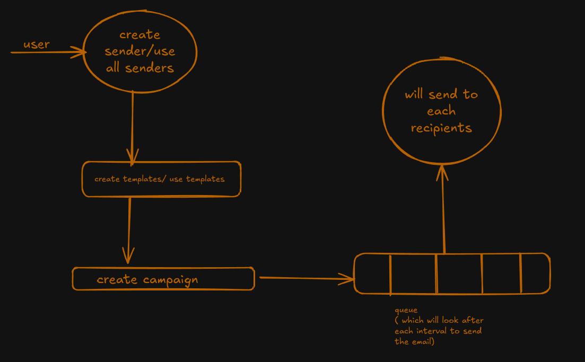

## EMAIL CRM SYSTEM BACKEND

## Technologies used in this :
1. TYPESCRIPT
2. NODEMAILER
3. JSONWEBTOKEN
4. BULL MQ


## ARCHITECTURE :


## Installation guide :

1. Clone the repo:
```bash
    git clone git@github.com:sandeep0009/email_crm_backend.git backend
```

2. CD into project:
```bash
    cd backend
```

3. Install dependencies:
```bash
    npm install
```

4. Add .env file at root of the folder with these variables:
```bash

    DB_URI=
    PORT=
    JWT_SECRET=
    ENCRYPTION_KEY=
    ENCRYPTION_IV=
    EMAIL_USER=
    EMAIL_PASS=
```

5. Run the project using these commands:
```bash
    npm run dev
    npm run dev:worker
```
